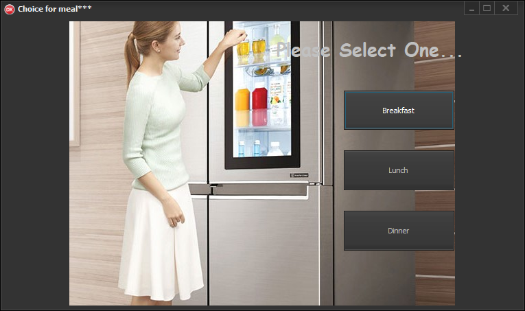
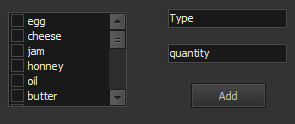
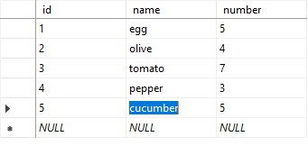
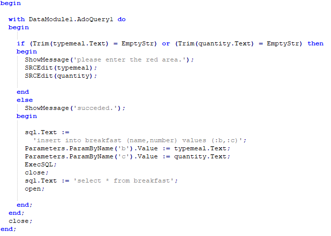

# MasterFridge
The fridge program which gives some advices about meals the owner could cook according to the fridge contents.

That sounds like a very useful program! If you have a list of all the items in your refrigerator, there are a few ways you can use that information to come up with recipe ideas. Here are a few suggestions:

Use a recipe search engine that allows you to input the ingredients you have on hand. Some popular options include Allrecipes, Supercook, and MyFridgeFood. Simply input the ingredients you have in your refrigerator, and the search engine will suggest recipes that use those ingredients.

Look up recipes for your favorite dishes and see if you have the ingredients to make them. For example, if you love spaghetti and meatballs, check to see if you have pasta, ground beef, tomato sauce, and other necessary ingredients. If you do, you can make the dish using what you already have on hand.

Consider making a frittata or omelette using the ingredients you have on hand. Eggs are a versatile ingredient that can be combined with many different vegetables, meats, and cheeses.

Use your ingredients to make a salad. If you have lettuce, vegetables, cheese, and some kind of protein (such as grilled chicken or tofu), you can make a healthy and satisfying salad.

Make a stir-fry using the vegetables and protein you have on hand. Simply chop up the vegetables and meat, and cook them in a pan with some oil and soy sauce or other seasonings.

These are just a few ideas for how to use your clever refrigerator program to come up with recipe ideas. With a little creativity, you can use the ingredients you have on hand to make a wide variety of delicious meals.

## Register or Login screen 

### Username/Email and Password fields: 
These are the basic components of any login screen. Users should be able to enter their username or email address and their password.

Remember Me checkbox: Including a "Remember Me" checkbox allows users to save their login credentials, so they don't have to enter them every time they want to log in.

"Forgot Password" link: If a user forgets their password, they should be able to reset it easily. Including a "Forgot Password" link on the login screen will allow users to reset their password using their email address or other identifying information.

"Create Account" or "Sign Up" link: If a user does not have an account, they should be able to create one easily. Including a "Create Account" or "Sign Up" link on the login screen will take users to a registration page where they can create an account.

Error messages: If a user enters incorrect login information, the login screen should display an error message indicating what went wrong (e.g. "Incorrect username or password").

Security measures: To ensure the security of user data, it's important to include security measures such as two-factor authentication or captcha verification.

When designing your login screen, you'll want to keep it simple and user-friendly. The goal is to make it as easy as possible for users to log in to their accounts while ensuring the security of their data.

## Product entry

### Entering Products with Artificial Intelligence

If the project is implemented, the weight of the product can be measured by using a camera and load sensor to detect the product. The camera can capture an image of the product and send it to a computer or microcontroller for analysis. The load sensor can be placed underneath the shelf or container where the product is stored, and it can measure the weight of the product when it is placed on the shelf.

The data from the camera and load sensor can be processed using computer vision algorithms and machine learning models to identify the product and calculate its weight. This information can then be displayed on the user interface, so that the user can see how much of a particular product is left in the refrigerator.

By implementing this technology, users can easily keep track of the quantity of each product in the refrigerator and avoid overstocking or waste. Additionally, it can help users plan their meals and grocery shopping more efficiently.

### Manual Entry of Products
To add a new food item to your refrigerator, first fill out the form below. Enter the name and type of the food (e.g. apple-fruit), then specify the quantity (e.g. 2 pieces). Finally, select the shelf where you want to add the item and click the "Add" button. Make sure to regularly check the food items in your refrigerator and try to consume the ones with approaching expiration dates to avoid wasting food.

